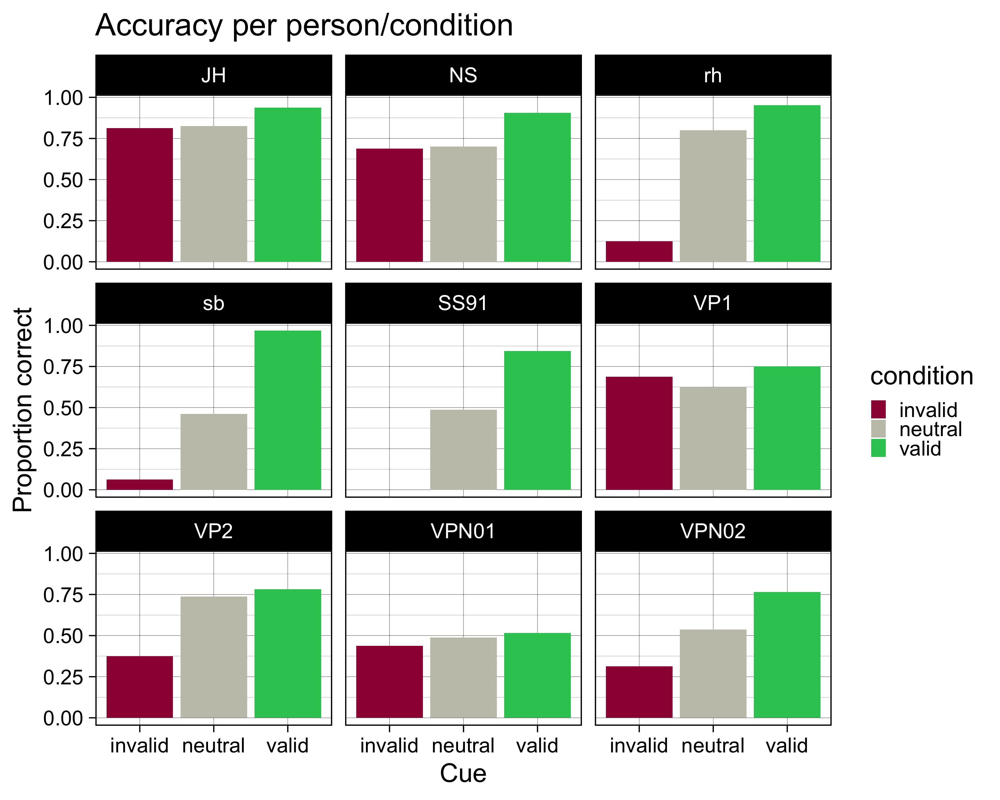

# RStudio Projekt 
Nun wollen wir die Datensätze aus dem Verhaltensexperiment von der letzten Sitzung in R importieren. 

Laden Sie das [RStudio Projekt](../../downloadable_files/import-data.zip) und öffnen Sie es.
Im Projekt ist ein R Script File enthalten (`import-data.R`).

<aside>
Falls Sie nur den R Code möchten, können Sie das File hier downloaden:
👉 [R Code](../../downloadable_files/import-data.R)
</aside>

# Einen Datensatz bearbeiten
Es gibt zwei Unterordner: `testdata` und `data`. In ersterem befindet sich ein Datensatz einer Testperson, in letzterem befinden sich mehrere Datensätze. Wir importieren und bearbeiten zuerst den Datensatz aus dem `testdata` Ordner, und wenden anschliessend das Gelernte gleichzeitig auf mehrere Datensätze an.


::: {.cell hash='02_importing_data_cache/html/unnamed-chunk-2_331edbe202d9b99d3f19a3068f63f103'}

```{.r .cell-code}
library(tidyverse)
```
:::

 
<aside>
In Ihrem Rstudio Projekt ist dieses File im Ordner `testdata` gespeichert (Hier in einem Ordner names `data/rdktest`). Bitte passen Sie den Pfad dementsprechend an, oder verwenden Sie den Code aus dem R Script im RStudio Projekt.
</aside>

## CSV File importieren


::: {.cell hash='02_importing_data_cache/html/unnamed-chunk-3_bb5716ed43781f742b803c5bc766f596'}

```{.r .cell-code}
testdata <- read_csv("testdata/ZZ_rdk-discrimination_2022_Mar_07_1403.csv") 
```
:::


### Variablen überprüfen


::: {.cell hash='02_importing_data_cache/html/unnamed-chunk-4_0f4f5551615ac472388d6950c92d0f40'}

```{.r .cell-code}
glimpse(testdata)
```

::: {.cell-output .cell-output-stdout}
```
Rows: 167
Columns: 39
$ cue                                        <chr> "none", "left", "right", "l…
$ direction                                  <chr> "right", "right", "right", …
$ practice_block_loop.thisRepN               <dbl> 0, 0, 0, 0, 0, 0, NA, NA, N…
$ practice_block_loop.thisTrialN             <dbl> 0, 1, 2, 3, 4, 5, NA, NA, N…
$ practice_block_loop.thisN                  <dbl> 0, 1, 2, 3, 4, 5, NA, NA, N…
$ practice_block_loop.thisIndex              <dbl> 5, 2, 1, 0, 4, 3, NA, NA, N…
$ main_blocks_loop.thisRepN                  <dbl> NA, NA, NA, NA, NA, NA, NA,…
$ main_blocks_loop.thisTrialN                <dbl> NA, NA, NA, NA, NA, NA, NA,…
$ main_blocks_loop.thisN                     <dbl> NA, NA, NA, NA, NA, NA, NA,…
$ main_blocks_loop.thisIndex                 <dbl> NA, NA, NA, NA, NA, NA, NA,…
$ static_isi.started                         <dbl> 0.01033428, 0.03202713, 0.0…
$ static_isi.stopped                         <dbl> 2.010334, 2.032027, 2.03217…
$ fixation_pre.started                       <dbl> 26.79425, 36.16522, 44.7852…
$ fixation_pre.stopped                       <chr> "None", "None", "None", "No…
$ image.started                              <dbl> 27.19849, 36.28205, 46.0032…
$ image.stopped                              <chr> "None", "None", "None", "No…
$ fixation_post.started                      <dbl> 28.17814, 37.28240, 47.0037…
$ fixation_post.stopped                      <chr> "None", "None", "None", "No…
$ dots_background.started                    <dbl> 32.18642, 41.30145, 52.0107…
$ dots_background.stopped                    <chr> "None", "None", "None", "No…
$ dots_stimulus.started                      <dbl> 32.18642, 41.30145, 52.0107…
$ dots_stimulus.stopped                      <chr> "None", "None", "None", "No…
$ dots_keyboard_response.keys                <chr> "None", "f", "j", "f", "Non…
$ dots_keyboard_response.started             <dbl> 32.18642, 41.30145, 52.0107…
$ dots_keyboard_response.stopped             <chr> "None", "None", "None", "No…
$ feedback_text.started                      <dbl> 33.70200, 42.28899, 52.9229…
$ feedback_text.stopped                      <chr> "None", "None", "None", "No…
$ dots_keyboard_response.rt                  <dbl> NA, 0.9339199, 0.8488816, 0…
$ instruction_main_text.started              <dbl> NA, NA, NA, NA, NA, NA, 81.…
$ instruction_main_text.stopped              <chr> NA, NA, NA, NA, NA, NA, "No…
$ instruction_main_keyboard_response.keys    <chr> NA, NA, NA, NA, NA, NA, "sp…
$ instruction_main_keyboard_response.rt      <dbl> NA, NA, NA, NA, NA, NA, 3.1…
$ instruction_main_keyboard_response.started <dbl> NA, NA, NA, NA, NA, NA, 81.…
$ instruction_main_keyboard_response.stopped <chr> NA, NA, NA, NA, NA, NA, "No…
$ Pseudonym                                  <chr> "ZZ", "ZZ", "ZZ", "ZZ", "ZZ…
$ date                                       <chr> "2022_Mar_07_1403", "2022_M…
$ expName                                    <chr> "rdk-discrimination", "rdk-…
$ psychopyVersion                            <chr> "03.02.21", "03.02.21", "03…
$ frameRate                                  <dbl> 59.9, 59.9, 59.9, 59.9, 59.…
```
:::
:::


## Practice Trials löschen


::: {.cell hash='02_importing_data_cache/html/unnamed-chunk-5_4d947ff3230bceeae5a0ba3b592ca3c5'}

```{.r .cell-code}
library(kableExtra)

testdata |> 
  slice_head(n = 12) |> 
  kbl() |> 
  kable_paper("striped", full_width = FALSE) |> 
  column_spec(2:7, bold = TRUE) |> 
  row_spec(1:6, bold = TRUE, color = "white", background = "#D7261E")
```

::: {.cell-output-display}
`````{=html}
<table class=" lightable-paper lightable-striped" style='font-family: "Arial Narrow", arial, helvetica, sans-serif; width: auto !important; margin-left: auto; margin-right: auto;'>
 <thead>
  <tr>
   <th style="text-align:left;"> cue </th>
   <th style="text-align:left;"> direction </th>
   <th style="text-align:right;"> practice_block_loop.thisRepN </th>
   <th style="text-align:right;"> practice_block_loop.thisTrialN </th>
   <th style="text-align:right;"> practice_block_loop.thisN </th>
   <th style="text-align:right;"> practice_block_loop.thisIndex </th>
   <th style="text-align:right;"> main_blocks_loop.thisRepN </th>
   <th style="text-align:right;"> main_blocks_loop.thisTrialN </th>
   <th style="text-align:right;"> main_blocks_loop.thisN </th>
   <th style="text-align:right;"> main_blocks_loop.thisIndex </th>
   <th style="text-align:right;"> static_isi.started </th>
   <th style="text-align:right;"> static_isi.stopped </th>
   <th style="text-align:right;"> fixation_pre.started </th>
   <th style="text-align:left;"> fixation_pre.stopped </th>
   <th style="text-align:right;"> image.started </th>
   <th style="text-align:left;"> image.stopped </th>
   <th style="text-align:right;"> fixation_post.started </th>
   <th style="text-align:left;"> fixation_post.stopped </th>
   <th style="text-align:right;"> dots_background.started </th>
   <th style="text-align:left;"> dots_background.stopped </th>
   <th style="text-align:right;"> dots_stimulus.started </th>
   <th style="text-align:left;"> dots_stimulus.stopped </th>
   <th style="text-align:left;"> dots_keyboard_response.keys </th>
   <th style="text-align:right;"> dots_keyboard_response.started </th>
   <th style="text-align:left;"> dots_keyboard_response.stopped </th>
   <th style="text-align:right;"> feedback_text.started </th>
   <th style="text-align:left;"> feedback_text.stopped </th>
   <th style="text-align:right;"> dots_keyboard_response.rt </th>
   <th style="text-align:right;"> instruction_main_text.started </th>
   <th style="text-align:left;"> instruction_main_text.stopped </th>
   <th style="text-align:left;"> instruction_main_keyboard_response.keys </th>
   <th style="text-align:right;"> instruction_main_keyboard_response.rt </th>
   <th style="text-align:right;"> instruction_main_keyboard_response.started </th>
   <th style="text-align:left;"> instruction_main_keyboard_response.stopped </th>
   <th style="text-align:left;"> Pseudonym </th>
   <th style="text-align:left;"> date </th>
   <th style="text-align:left;"> expName </th>
   <th style="text-align:left;"> psychopyVersion </th>
   <th style="text-align:right;"> frameRate </th>
  </tr>
 </thead>
<tbody>
  <tr>
   <td style="text-align:left;font-weight: bold;color: white !important;background-color: #D7261E !important;"> none </td>
   <td style="text-align:left;font-weight: bold;font-weight: bold;color: white !important;background-color: #D7261E !important;"> right </td>
   <td style="text-align:right;font-weight: bold;font-weight: bold;color: white !important;background-color: #D7261E !important;"> 0 </td>
   <td style="text-align:right;font-weight: bold;font-weight: bold;color: white !important;background-color: #D7261E !important;"> 0 </td>
   <td style="text-align:right;font-weight: bold;font-weight: bold;color: white !important;background-color: #D7261E !important;"> 0 </td>
   <td style="text-align:right;font-weight: bold;font-weight: bold;color: white !important;background-color: #D7261E !important;"> 5 </td>
   <td style="text-align:right;font-weight: bold;font-weight: bold;color: white !important;background-color: #D7261E !important;"> NA </td>
   <td style="text-align:right;font-weight: bold;color: white !important;background-color: #D7261E !important;"> NA </td>
   <td style="text-align:right;font-weight: bold;color: white !important;background-color: #D7261E !important;"> NA </td>
   <td style="text-align:right;font-weight: bold;color: white !important;background-color: #D7261E !important;"> NA </td>
   <td style="text-align:right;font-weight: bold;color: white !important;background-color: #D7261E !important;"> 0.0103343 </td>
   <td style="text-align:right;font-weight: bold;color: white !important;background-color: #D7261E !important;"> 2.010334 </td>
   <td style="text-align:right;font-weight: bold;color: white !important;background-color: #D7261E !important;"> 26.79425 </td>
   <td style="text-align:left;font-weight: bold;color: white !important;background-color: #D7261E !important;"> None </td>
   <td style="text-align:right;font-weight: bold;color: white !important;background-color: #D7261E !important;"> 27.19849 </td>
   <td style="text-align:left;font-weight: bold;color: white !important;background-color: #D7261E !important;"> None </td>
   <td style="text-align:right;font-weight: bold;color: white !important;background-color: #D7261E !important;"> 28.17814 </td>
   <td style="text-align:left;font-weight: bold;color: white !important;background-color: #D7261E !important;"> None </td>
   <td style="text-align:right;font-weight: bold;color: white !important;background-color: #D7261E !important;"> 32.18642 </td>
   <td style="text-align:left;font-weight: bold;color: white !important;background-color: #D7261E !important;"> None </td>
   <td style="text-align:right;font-weight: bold;color: white !important;background-color: #D7261E !important;"> 32.18642 </td>
   <td style="text-align:left;font-weight: bold;color: white !important;background-color: #D7261E !important;"> None </td>
   <td style="text-align:left;font-weight: bold;color: white !important;background-color: #D7261E !important;"> None </td>
   <td style="text-align:right;font-weight: bold;color: white !important;background-color: #D7261E !important;"> 32.18642 </td>
   <td style="text-align:left;font-weight: bold;color: white !important;background-color: #D7261E !important;"> None </td>
   <td style="text-align:right;font-weight: bold;color: white !important;background-color: #D7261E !important;"> 33.70200 </td>
   <td style="text-align:left;font-weight: bold;color: white !important;background-color: #D7261E !important;"> None </td>
   <td style="text-align:right;font-weight: bold;color: white !important;background-color: #D7261E !important;"> NA </td>
   <td style="text-align:right;font-weight: bold;color: white !important;background-color: #D7261E !important;"> NA </td>
   <td style="text-align:left;font-weight: bold;color: white !important;background-color: #D7261E !important;"> NA </td>
   <td style="text-align:left;font-weight: bold;color: white !important;background-color: #D7261E !important;"> NA </td>
   <td style="text-align:right;font-weight: bold;color: white !important;background-color: #D7261E !important;"> NA </td>
   <td style="text-align:right;font-weight: bold;color: white !important;background-color: #D7261E !important;"> NA </td>
   <td style="text-align:left;font-weight: bold;color: white !important;background-color: #D7261E !important;"> NA </td>
   <td style="text-align:left;font-weight: bold;color: white !important;background-color: #D7261E !important;"> ZZ </td>
   <td style="text-align:left;font-weight: bold;color: white !important;background-color: #D7261E !important;"> 2022_Mar_07_1403 </td>
   <td style="text-align:left;font-weight: bold;color: white !important;background-color: #D7261E !important;"> rdk-discrimination </td>
   <td style="text-align:left;font-weight: bold;color: white !important;background-color: #D7261E !important;"> 03.02.21 </td>
   <td style="text-align:right;font-weight: bold;color: white !important;background-color: #D7261E !important;"> 59.9 </td>
  </tr>
  <tr>
   <td style="text-align:left;font-weight: bold;color: white !important;background-color: #D7261E !important;"> left </td>
   <td style="text-align:left;font-weight: bold;font-weight: bold;color: white !important;background-color: #D7261E !important;"> right </td>
   <td style="text-align:right;font-weight: bold;font-weight: bold;color: white !important;background-color: #D7261E !important;"> 0 </td>
   <td style="text-align:right;font-weight: bold;font-weight: bold;color: white !important;background-color: #D7261E !important;"> 1 </td>
   <td style="text-align:right;font-weight: bold;font-weight: bold;color: white !important;background-color: #D7261E !important;"> 1 </td>
   <td style="text-align:right;font-weight: bold;font-weight: bold;color: white !important;background-color: #D7261E !important;"> 2 </td>
   <td style="text-align:right;font-weight: bold;font-weight: bold;color: white !important;background-color: #D7261E !important;"> NA </td>
   <td style="text-align:right;font-weight: bold;color: white !important;background-color: #D7261E !important;"> NA </td>
   <td style="text-align:right;font-weight: bold;color: white !important;background-color: #D7261E !important;"> NA </td>
   <td style="text-align:right;font-weight: bold;color: white !important;background-color: #D7261E !important;"> NA </td>
   <td style="text-align:right;font-weight: bold;color: white !important;background-color: #D7261E !important;"> 0.0320271 </td>
   <td style="text-align:right;font-weight: bold;color: white !important;background-color: #D7261E !important;"> 2.032027 </td>
   <td style="text-align:right;font-weight: bold;color: white !important;background-color: #D7261E !important;"> 36.16522 </td>
   <td style="text-align:left;font-weight: bold;color: white !important;background-color: #D7261E !important;"> None </td>
   <td style="text-align:right;font-weight: bold;color: white !important;background-color: #D7261E !important;"> 36.28205 </td>
   <td style="text-align:left;font-weight: bold;color: white !important;background-color: #D7261E !important;"> None </td>
   <td style="text-align:right;font-weight: bold;color: white !important;background-color: #D7261E !important;"> 37.28240 </td>
   <td style="text-align:left;font-weight: bold;color: white !important;background-color: #D7261E !important;"> None </td>
   <td style="text-align:right;font-weight: bold;color: white !important;background-color: #D7261E !important;"> 41.30145 </td>
   <td style="text-align:left;font-weight: bold;color: white !important;background-color: #D7261E !important;"> None </td>
   <td style="text-align:right;font-weight: bold;color: white !important;background-color: #D7261E !important;"> 41.30145 </td>
   <td style="text-align:left;font-weight: bold;color: white !important;background-color: #D7261E !important;"> None </td>
   <td style="text-align:left;font-weight: bold;color: white !important;background-color: #D7261E !important;"> f </td>
   <td style="text-align:right;font-weight: bold;color: white !important;background-color: #D7261E !important;"> 41.30145 </td>
   <td style="text-align:left;font-weight: bold;color: white !important;background-color: #D7261E !important;"> None </td>
   <td style="text-align:right;font-weight: bold;color: white !important;background-color: #D7261E !important;"> 42.28899 </td>
   <td style="text-align:left;font-weight: bold;color: white !important;background-color: #D7261E !important;"> None </td>
   <td style="text-align:right;font-weight: bold;color: white !important;background-color: #D7261E !important;"> 0.9339199 </td>
   <td style="text-align:right;font-weight: bold;color: white !important;background-color: #D7261E !important;"> NA </td>
   <td style="text-align:left;font-weight: bold;color: white !important;background-color: #D7261E !important;"> NA </td>
   <td style="text-align:left;font-weight: bold;color: white !important;background-color: #D7261E !important;"> NA </td>
   <td style="text-align:right;font-weight: bold;color: white !important;background-color: #D7261E !important;"> NA </td>
   <td style="text-align:right;font-weight: bold;color: white !important;background-color: #D7261E !important;"> NA </td>
   <td style="text-align:left;font-weight: bold;color: white !important;background-color: #D7261E !important;"> NA </td>
   <td style="text-align:left;font-weight: bold;color: white !important;background-color: #D7261E !important;"> ZZ </td>
   <td style="text-align:left;font-weight: bold;color: white !important;background-color: #D7261E !important;"> 2022_Mar_07_1403 </td>
   <td style="text-align:left;font-weight: bold;color: white !important;background-color: #D7261E !important;"> rdk-discrimination </td>
   <td style="text-align:left;font-weight: bold;color: white !important;background-color: #D7261E !important;"> 03.02.21 </td>
   <td style="text-align:right;font-weight: bold;color: white !important;background-color: #D7261E !important;"> 59.9 </td>
  </tr>
  <tr>
   <td style="text-align:left;font-weight: bold;color: white !important;background-color: #D7261E !important;"> right </td>
   <td style="text-align:left;font-weight: bold;font-weight: bold;color: white !important;background-color: #D7261E !important;"> right </td>
   <td style="text-align:right;font-weight: bold;font-weight: bold;color: white !important;background-color: #D7261E !important;"> 0 </td>
   <td style="text-align:right;font-weight: bold;font-weight: bold;color: white !important;background-color: #D7261E !important;"> 2 </td>
   <td style="text-align:right;font-weight: bold;font-weight: bold;color: white !important;background-color: #D7261E !important;"> 2 </td>
   <td style="text-align:right;font-weight: bold;font-weight: bold;color: white !important;background-color: #D7261E !important;"> 1 </td>
   <td style="text-align:right;font-weight: bold;font-weight: bold;color: white !important;background-color: #D7261E !important;"> NA </td>
   <td style="text-align:right;font-weight: bold;color: white !important;background-color: #D7261E !important;"> NA </td>
   <td style="text-align:right;font-weight: bold;color: white !important;background-color: #D7261E !important;"> NA </td>
   <td style="text-align:right;font-weight: bold;color: white !important;background-color: #D7261E !important;"> NA </td>
   <td style="text-align:right;font-weight: bold;color: white !important;background-color: #D7261E !important;"> 0.0321732 </td>
   <td style="text-align:right;font-weight: bold;color: white !important;background-color: #D7261E !important;"> 2.032173 </td>
   <td style="text-align:right;font-weight: bold;color: white !important;background-color: #D7261E !important;"> 44.78521 </td>
   <td style="text-align:left;font-weight: bold;color: white !important;background-color: #D7261E !important;"> None </td>
   <td style="text-align:right;font-weight: bold;color: white !important;background-color: #D7261E !important;"> 46.00329 </td>
   <td style="text-align:left;font-weight: bold;color: white !important;background-color: #D7261E !important;"> None </td>
   <td style="text-align:right;font-weight: bold;color: white !important;background-color: #D7261E !important;"> 47.00374 </td>
   <td style="text-align:left;font-weight: bold;color: white !important;background-color: #D7261E !important;"> None </td>
   <td style="text-align:right;font-weight: bold;color: white !important;background-color: #D7261E !important;"> 52.01072 </td>
   <td style="text-align:left;font-weight: bold;color: white !important;background-color: #D7261E !important;"> None </td>
   <td style="text-align:right;font-weight: bold;color: white !important;background-color: #D7261E !important;"> 52.01072 </td>
   <td style="text-align:left;font-weight: bold;color: white !important;background-color: #D7261E !important;"> None </td>
   <td style="text-align:left;font-weight: bold;color: white !important;background-color: #D7261E !important;"> j </td>
   <td style="text-align:right;font-weight: bold;color: white !important;background-color: #D7261E !important;"> 52.01072 </td>
   <td style="text-align:left;font-weight: bold;color: white !important;background-color: #D7261E !important;"> None </td>
   <td style="text-align:right;font-weight: bold;color: white !important;background-color: #D7261E !important;"> 52.92295 </td>
   <td style="text-align:left;font-weight: bold;color: white !important;background-color: #D7261E !important;"> None </td>
   <td style="text-align:right;font-weight: bold;color: white !important;background-color: #D7261E !important;"> 0.8488816 </td>
   <td style="text-align:right;font-weight: bold;color: white !important;background-color: #D7261E !important;"> NA </td>
   <td style="text-align:left;font-weight: bold;color: white !important;background-color: #D7261E !important;"> NA </td>
   <td style="text-align:left;font-weight: bold;color: white !important;background-color: #D7261E !important;"> NA </td>
   <td style="text-align:right;font-weight: bold;color: white !important;background-color: #D7261E !important;"> NA </td>
   <td style="text-align:right;font-weight: bold;color: white !important;background-color: #D7261E !important;"> NA </td>
   <td style="text-align:left;font-weight: bold;color: white !important;background-color: #D7261E !important;"> NA </td>
   <td style="text-align:left;font-weight: bold;color: white !important;background-color: #D7261E !important;"> ZZ </td>
   <td style="text-align:left;font-weight: bold;color: white !important;background-color: #D7261E !important;"> 2022_Mar_07_1403 </td>
   <td style="text-align:left;font-weight: bold;color: white !important;background-color: #D7261E !important;"> rdk-discrimination </td>
   <td style="text-align:left;font-weight: bold;color: white !important;background-color: #D7261E !important;"> 03.02.21 </td>
   <td style="text-align:right;font-weight: bold;color: white !important;background-color: #D7261E !important;"> 59.9 </td>
  </tr>
  <tr>
   <td style="text-align:left;font-weight: bold;color: white !important;background-color: #D7261E !important;"> left </td>
   <td style="text-align:left;font-weight: bold;font-weight: bold;color: white !important;background-color: #D7261E !important;"> left </td>
   <td style="text-align:right;font-weight: bold;font-weight: bold;color: white !important;background-color: #D7261E !important;"> 0 </td>
   <td style="text-align:right;font-weight: bold;font-weight: bold;color: white !important;background-color: #D7261E !important;"> 3 </td>
   <td style="text-align:right;font-weight: bold;font-weight: bold;color: white !important;background-color: #D7261E !important;"> 3 </td>
   <td style="text-align:right;font-weight: bold;font-weight: bold;color: white !important;background-color: #D7261E !important;"> 0 </td>
   <td style="text-align:right;font-weight: bold;font-weight: bold;color: white !important;background-color: #D7261E !important;"> NA </td>
   <td style="text-align:right;font-weight: bold;color: white !important;background-color: #D7261E !important;"> NA </td>
   <td style="text-align:right;font-weight: bold;color: white !important;background-color: #D7261E !important;"> NA </td>
   <td style="text-align:right;font-weight: bold;color: white !important;background-color: #D7261E !important;"> NA </td>
   <td style="text-align:right;font-weight: bold;color: white !important;background-color: #D7261E !important;"> 0.0321533 </td>
   <td style="text-align:right;font-weight: bold;color: white !important;background-color: #D7261E !important;"> 2.032153 </td>
   <td style="text-align:right;font-weight: bold;color: white !important;background-color: #D7261E !important;"> 55.39138 </td>
   <td style="text-align:left;font-weight: bold;color: white !important;background-color: #D7261E !important;"> None </td>
   <td style="text-align:right;font-weight: bold;color: white !important;background-color: #D7261E !important;"> 56.19407 </td>
   <td style="text-align:left;font-weight: bold;color: white !important;background-color: #D7261E !important;"> None </td>
   <td style="text-align:right;font-weight: bold;color: white !important;background-color: #D7261E !important;"> 57.22527 </td>
   <td style="text-align:left;font-weight: bold;color: white !important;background-color: #D7261E !important;"> None </td>
   <td style="text-align:right;font-weight: bold;color: white !important;background-color: #D7261E !important;"> 61.23181 </td>
   <td style="text-align:left;font-weight: bold;color: white !important;background-color: #D7261E !important;"> None </td>
   <td style="text-align:right;font-weight: bold;color: white !important;background-color: #D7261E !important;"> 61.23181 </td>
   <td style="text-align:left;font-weight: bold;color: white !important;background-color: #D7261E !important;"> None </td>
   <td style="text-align:left;font-weight: bold;color: white !important;background-color: #D7261E !important;"> f </td>
   <td style="text-align:right;font-weight: bold;color: white !important;background-color: #D7261E !important;"> 61.23181 </td>
   <td style="text-align:left;font-weight: bold;color: white !important;background-color: #D7261E !important;"> None </td>
   <td style="text-align:right;font-weight: bold;color: white !important;background-color: #D7261E !important;"> 62.21611 </td>
   <td style="text-align:left;font-weight: bold;color: white !important;background-color: #D7261E !important;"> None </td>
   <td style="text-align:right;font-weight: bold;color: white !important;background-color: #D7261E !important;"> 0.9396018 </td>
   <td style="text-align:right;font-weight: bold;color: white !important;background-color: #D7261E !important;"> NA </td>
   <td style="text-align:left;font-weight: bold;color: white !important;background-color: #D7261E !important;"> NA </td>
   <td style="text-align:left;font-weight: bold;color: white !important;background-color: #D7261E !important;"> NA </td>
   <td style="text-align:right;font-weight: bold;color: white !important;background-color: #D7261E !important;"> NA </td>
   <td style="text-align:right;font-weight: bold;color: white !important;background-color: #D7261E !important;"> NA </td>
   <td style="text-align:left;font-weight: bold;color: white !important;background-color: #D7261E !important;"> NA </td>
   <td style="text-align:left;font-weight: bold;color: white !important;background-color: #D7261E !important;"> ZZ </td>
   <td style="text-align:left;font-weight: bold;color: white !important;background-color: #D7261E !important;"> 2022_Mar_07_1403 </td>
   <td style="text-align:left;font-weight: bold;color: white !important;background-color: #D7261E !important;"> rdk-discrimination </td>
   <td style="text-align:left;font-weight: bold;color: white !important;background-color: #D7261E !important;"> 03.02.21 </td>
   <td style="text-align:right;font-weight: bold;color: white !important;background-color: #D7261E !important;"> 59.9 </td>
  </tr>
  <tr>
   <td style="text-align:left;font-weight: bold;color: white !important;background-color: #D7261E !important;"> none </td>
   <td style="text-align:left;font-weight: bold;font-weight: bold;color: white !important;background-color: #D7261E !important;"> left </td>
   <td style="text-align:right;font-weight: bold;font-weight: bold;color: white !important;background-color: #D7261E !important;"> 0 </td>
   <td style="text-align:right;font-weight: bold;font-weight: bold;color: white !important;background-color: #D7261E !important;"> 4 </td>
   <td style="text-align:right;font-weight: bold;font-weight: bold;color: white !important;background-color: #D7261E !important;"> 4 </td>
   <td style="text-align:right;font-weight: bold;font-weight: bold;color: white !important;background-color: #D7261E !important;"> 4 </td>
   <td style="text-align:right;font-weight: bold;font-weight: bold;color: white !important;background-color: #D7261E !important;"> NA </td>
   <td style="text-align:right;font-weight: bold;color: white !important;background-color: #D7261E !important;"> NA </td>
   <td style="text-align:right;font-weight: bold;color: white !important;background-color: #D7261E !important;"> NA </td>
   <td style="text-align:right;font-weight: bold;color: white !important;background-color: #D7261E !important;"> NA </td>
   <td style="text-align:right;font-weight: bold;color: white !important;background-color: #D7261E !important;"> 0.0321391 </td>
   <td style="text-align:right;font-weight: bold;color: white !important;background-color: #D7261E !important;"> 2.032139 </td>
   <td style="text-align:right;font-weight: bold;color: white !important;background-color: #D7261E !important;"> 64.71204 </td>
   <td style="text-align:left;font-weight: bold;color: white !important;background-color: #D7261E !important;"> None </td>
   <td style="text-align:right;font-weight: bold;color: white !important;background-color: #D7261E !important;"> 64.81315 </td>
   <td style="text-align:left;font-weight: bold;color: white !important;background-color: #D7261E !important;"> None </td>
   <td style="text-align:right;font-weight: bold;color: white !important;background-color: #D7261E !important;"> 65.84603 </td>
   <td style="text-align:left;font-weight: bold;color: white !important;background-color: #D7261E !important;"> None </td>
   <td style="text-align:right;font-weight: bold;color: white !important;background-color: #D7261E !important;"> 69.25240 </td>
   <td style="text-align:left;font-weight: bold;color: white !important;background-color: #D7261E !important;"> None </td>
   <td style="text-align:right;font-weight: bold;color: white !important;background-color: #D7261E !important;"> 69.25240 </td>
   <td style="text-align:left;font-weight: bold;color: white !important;background-color: #D7261E !important;"> None </td>
   <td style="text-align:left;font-weight: bold;color: white !important;background-color: #D7261E !important;"> None </td>
   <td style="text-align:right;font-weight: bold;color: white !important;background-color: #D7261E !important;"> 69.25240 </td>
   <td style="text-align:left;font-weight: bold;color: white !important;background-color: #D7261E !important;"> None </td>
   <td style="text-align:right;font-weight: bold;color: white !important;background-color: #D7261E !important;"> 70.78541 </td>
   <td style="text-align:left;font-weight: bold;color: white !important;background-color: #D7261E !important;"> None </td>
   <td style="text-align:right;font-weight: bold;color: white !important;background-color: #D7261E !important;"> NA </td>
   <td style="text-align:right;font-weight: bold;color: white !important;background-color: #D7261E !important;"> NA </td>
   <td style="text-align:left;font-weight: bold;color: white !important;background-color: #D7261E !important;"> NA </td>
   <td style="text-align:left;font-weight: bold;color: white !important;background-color: #D7261E !important;"> NA </td>
   <td style="text-align:right;font-weight: bold;color: white !important;background-color: #D7261E !important;"> NA </td>
   <td style="text-align:right;font-weight: bold;color: white !important;background-color: #D7261E !important;"> NA </td>
   <td style="text-align:left;font-weight: bold;color: white !important;background-color: #D7261E !important;"> NA </td>
   <td style="text-align:left;font-weight: bold;color: white !important;background-color: #D7261E !important;"> ZZ </td>
   <td style="text-align:left;font-weight: bold;color: white !important;background-color: #D7261E !important;"> 2022_Mar_07_1403 </td>
   <td style="text-align:left;font-weight: bold;color: white !important;background-color: #D7261E !important;"> rdk-discrimination </td>
   <td style="text-align:left;font-weight: bold;color: white !important;background-color: #D7261E !important;"> 03.02.21 </td>
   <td style="text-align:right;font-weight: bold;color: white !important;background-color: #D7261E !important;"> 59.9 </td>
  </tr>
  <tr>
   <td style="text-align:left;font-weight: bold;color: white !important;background-color: #D7261E !important;"> right </td>
   <td style="text-align:left;font-weight: bold;font-weight: bold;color: white !important;background-color: #D7261E !important;"> left </td>
   <td style="text-align:right;font-weight: bold;font-weight: bold;color: white !important;background-color: #D7261E !important;"> 0 </td>
   <td style="text-align:right;font-weight: bold;font-weight: bold;color: white !important;background-color: #D7261E !important;"> 5 </td>
   <td style="text-align:right;font-weight: bold;font-weight: bold;color: white !important;background-color: #D7261E !important;"> 5 </td>
   <td style="text-align:right;font-weight: bold;font-weight: bold;color: white !important;background-color: #D7261E !important;"> 3 </td>
   <td style="text-align:right;font-weight: bold;font-weight: bold;color: white !important;background-color: #D7261E !important;"> NA </td>
   <td style="text-align:right;font-weight: bold;color: white !important;background-color: #D7261E !important;"> NA </td>
   <td style="text-align:right;font-weight: bold;color: white !important;background-color: #D7261E !important;"> NA </td>
   <td style="text-align:right;font-weight: bold;color: white !important;background-color: #D7261E !important;"> NA </td>
   <td style="text-align:right;font-weight: bold;color: white !important;background-color: #D7261E !important;"> 0.0323178 </td>
   <td style="text-align:right;font-weight: bold;color: white !important;background-color: #D7261E !important;"> 2.032318 </td>
   <td style="text-align:right;font-weight: bold;color: white !important;background-color: #D7261E !important;"> 73.24960 </td>
   <td style="text-align:left;font-weight: bold;color: white !important;background-color: #D7261E !important;"> None </td>
   <td style="text-align:right;font-weight: bold;color: white !important;background-color: #D7261E !important;"> 74.45209 </td>
   <td style="text-align:left;font-weight: bold;color: white !important;background-color: #D7261E !important;"> None </td>
   <td style="text-align:right;font-weight: bold;color: white !important;background-color: #D7261E !important;"> 75.48391 </td>
   <td style="text-align:left;font-weight: bold;color: white !important;background-color: #D7261E !important;"> None </td>
   <td style="text-align:right;font-weight: bold;color: white !important;background-color: #D7261E !important;"> 79.99045 </td>
   <td style="text-align:left;font-weight: bold;color: white !important;background-color: #D7261E !important;"> None </td>
   <td style="text-align:right;font-weight: bold;color: white !important;background-color: #D7261E !important;"> 79.99045 </td>
   <td style="text-align:left;font-weight: bold;color: white !important;background-color: #D7261E !important;"> None </td>
   <td style="text-align:left;font-weight: bold;color: white !important;background-color: #D7261E !important;"> f </td>
   <td style="text-align:right;font-weight: bold;color: white !important;background-color: #D7261E !important;"> 79.99045 </td>
   <td style="text-align:left;font-weight: bold;color: white !important;background-color: #D7261E !important;"> None </td>
   <td style="text-align:right;font-weight: bold;color: white !important;background-color: #D7261E !important;"> 80.80311 </td>
   <td style="text-align:left;font-weight: bold;color: white !important;background-color: #D7261E !important;"> None </td>
   <td style="text-align:right;font-weight: bold;color: white !important;background-color: #D7261E !important;"> 0.7490084 </td>
   <td style="text-align:right;font-weight: bold;color: white !important;background-color: #D7261E !important;"> NA </td>
   <td style="text-align:left;font-weight: bold;color: white !important;background-color: #D7261E !important;"> NA </td>
   <td style="text-align:left;font-weight: bold;color: white !important;background-color: #D7261E !important;"> NA </td>
   <td style="text-align:right;font-weight: bold;color: white !important;background-color: #D7261E !important;"> NA </td>
   <td style="text-align:right;font-weight: bold;color: white !important;background-color: #D7261E !important;"> NA </td>
   <td style="text-align:left;font-weight: bold;color: white !important;background-color: #D7261E !important;"> NA </td>
   <td style="text-align:left;font-weight: bold;color: white !important;background-color: #D7261E !important;"> ZZ </td>
   <td style="text-align:left;font-weight: bold;color: white !important;background-color: #D7261E !important;"> 2022_Mar_07_1403 </td>
   <td style="text-align:left;font-weight: bold;color: white !important;background-color: #D7261E !important;"> rdk-discrimination </td>
   <td style="text-align:left;font-weight: bold;color: white !important;background-color: #D7261E !important;"> 03.02.21 </td>
   <td style="text-align:right;font-weight: bold;color: white !important;background-color: #D7261E !important;"> 59.9 </td>
  </tr>
  <tr>
   <td style="text-align:left;"> NA </td>
   <td style="text-align:left;font-weight: bold;"> NA </td>
   <td style="text-align:right;font-weight: bold;"> NA </td>
   <td style="text-align:right;font-weight: bold;"> NA </td>
   <td style="text-align:right;font-weight: bold;"> NA </td>
   <td style="text-align:right;font-weight: bold;"> NA </td>
   <td style="text-align:right;font-weight: bold;"> NA </td>
   <td style="text-align:right;"> NA </td>
   <td style="text-align:right;"> NA </td>
   <td style="text-align:right;"> NA </td>
   <td style="text-align:right;"> NA </td>
   <td style="text-align:right;"> NA </td>
   <td style="text-align:right;"> NA </td>
   <td style="text-align:left;"> NA </td>
   <td style="text-align:right;"> NA </td>
   <td style="text-align:left;"> NA </td>
   <td style="text-align:right;"> NA </td>
   <td style="text-align:left;"> NA </td>
   <td style="text-align:right;"> NA </td>
   <td style="text-align:left;"> NA </td>
   <td style="text-align:right;"> NA </td>
   <td style="text-align:left;"> NA </td>
   <td style="text-align:left;"> NA </td>
   <td style="text-align:right;"> NA </td>
   <td style="text-align:left;"> NA </td>
   <td style="text-align:right;"> NA </td>
   <td style="text-align:left;"> NA </td>
   <td style="text-align:right;"> NA </td>
   <td style="text-align:right;"> 81.30346 </td>
   <td style="text-align:left;"> None </td>
   <td style="text-align:left;"> space </td>
   <td style="text-align:right;"> 3.187924 </td>
   <td style="text-align:right;"> 81.30346 </td>
   <td style="text-align:left;"> None </td>
   <td style="text-align:left;"> ZZ </td>
   <td style="text-align:left;"> 2022_Mar_07_1403 </td>
   <td style="text-align:left;"> rdk-discrimination </td>
   <td style="text-align:left;"> 03.02.21 </td>
   <td style="text-align:right;"> 59.9 </td>
  </tr>
  <tr>
   <td style="text-align:left;"> right </td>
   <td style="text-align:left;font-weight: bold;"> right </td>
   <td style="text-align:right;font-weight: bold;"> NA </td>
   <td style="text-align:right;font-weight: bold;"> NA </td>
   <td style="text-align:right;font-weight: bold;"> NA </td>
   <td style="text-align:right;font-weight: bold;"> NA </td>
   <td style="text-align:right;font-weight: bold;"> 0 </td>
   <td style="text-align:right;"> 0 </td>
   <td style="text-align:right;"> 0 </td>
   <td style="text-align:right;"> 18 </td>
   <td style="text-align:right;"> 0.0160001 </td>
   <td style="text-align:right;"> 2.016000 </td>
   <td style="text-align:right;"> 86.52245 </td>
   <td style="text-align:left;"> None </td>
   <td style="text-align:right;"> 86.89231 </td>
   <td style="text-align:left;"> None </td>
   <td style="text-align:right;"> 87.92302 </td>
   <td style="text-align:left;"> None </td>
   <td style="text-align:right;"> 92.92987 </td>
   <td style="text-align:left;"> None </td>
   <td style="text-align:right;"> 92.92987 </td>
   <td style="text-align:left;"> None </td>
   <td style="text-align:left;"> j </td>
   <td style="text-align:right;"> 92.92987 </td>
   <td style="text-align:left;"> None </td>
   <td style="text-align:right;"> 93.70924 </td>
   <td style="text-align:left;"> None </td>
   <td style="text-align:right;"> 0.7136441 </td>
   <td style="text-align:right;"> NA </td>
   <td style="text-align:left;"> NA </td>
   <td style="text-align:left;"> NA </td>
   <td style="text-align:right;"> NA </td>
   <td style="text-align:right;"> NA </td>
   <td style="text-align:left;"> NA </td>
   <td style="text-align:left;"> ZZ </td>
   <td style="text-align:left;"> 2022_Mar_07_1403 </td>
   <td style="text-align:left;"> rdk-discrimination </td>
   <td style="text-align:left;"> 03.02.21 </td>
   <td style="text-align:right;"> 59.9 </td>
  </tr>
  <tr>
   <td style="text-align:left;"> right </td>
   <td style="text-align:left;font-weight: bold;"> right </td>
   <td style="text-align:right;font-weight: bold;"> NA </td>
   <td style="text-align:right;font-weight: bold;"> NA </td>
   <td style="text-align:right;font-weight: bold;"> NA </td>
   <td style="text-align:right;font-weight: bold;"> NA </td>
   <td style="text-align:right;font-weight: bold;"> 0 </td>
   <td style="text-align:right;"> 1 </td>
   <td style="text-align:right;"> 1 </td>
   <td style="text-align:right;"> 31 </td>
   <td style="text-align:right;"> 0.0318162 </td>
   <td style="text-align:right;"> 2.031816 </td>
   <td style="text-align:right;"> 96.17699 </td>
   <td style="text-align:left;"> None </td>
   <td style="text-align:right;"> 96.54602 </td>
   <td style="text-align:left;"> None </td>
   <td style="text-align:right;"> 97.57770 </td>
   <td style="text-align:left;"> None </td>
   <td style="text-align:right;"> 101.58423 </td>
   <td style="text-align:left;"> None </td>
   <td style="text-align:right;"> 101.58423 </td>
   <td style="text-align:left;"> None </td>
   <td style="text-align:left;"> j </td>
   <td style="text-align:right;"> 101.58423 </td>
   <td style="text-align:left;"> None </td>
   <td style="text-align:right;"> 102.26673 </td>
   <td style="text-align:left;"> None </td>
   <td style="text-align:right;"> 0.6271285 </td>
   <td style="text-align:right;"> NA </td>
   <td style="text-align:left;"> NA </td>
   <td style="text-align:left;"> NA </td>
   <td style="text-align:right;"> NA </td>
   <td style="text-align:right;"> NA </td>
   <td style="text-align:left;"> NA </td>
   <td style="text-align:left;"> ZZ </td>
   <td style="text-align:left;"> 2022_Mar_07_1403 </td>
   <td style="text-align:left;"> rdk-discrimination </td>
   <td style="text-align:left;"> 03.02.21 </td>
   <td style="text-align:right;"> 59.9 </td>
  </tr>
  <tr>
   <td style="text-align:left;"> none </td>
   <td style="text-align:left;font-weight: bold;"> right </td>
   <td style="text-align:right;font-weight: bold;"> NA </td>
   <td style="text-align:right;font-weight: bold;"> NA </td>
   <td style="text-align:right;font-weight: bold;"> NA </td>
   <td style="text-align:right;font-weight: bold;"> NA </td>
   <td style="text-align:right;font-weight: bold;"> 0 </td>
   <td style="text-align:right;"> 2 </td>
   <td style="text-align:right;"> 2 </td>
   <td style="text-align:right;"> 66 </td>
   <td style="text-align:right;"> 0.0321148 </td>
   <td style="text-align:right;"> 2.032115 </td>
   <td style="text-align:right;"> 104.76463 </td>
   <td style="text-align:left;"> None </td>
   <td style="text-align:right;"> 105.13302 </td>
   <td style="text-align:left;"> None </td>
   <td style="text-align:right;"> 106.16508 </td>
   <td style="text-align:left;"> None </td>
   <td style="text-align:right;"> 110.67183 </td>
   <td style="text-align:left;"> None </td>
   <td style="text-align:right;"> 110.67183 </td>
   <td style="text-align:left;"> None </td>
   <td style="text-align:left;"> f </td>
   <td style="text-align:right;"> 110.67183 </td>
   <td style="text-align:left;"> None </td>
   <td style="text-align:right;"> 111.38828 </td>
   <td style="text-align:left;"> None </td>
   <td style="text-align:right;"> 0.6703410 </td>
   <td style="text-align:right;"> NA </td>
   <td style="text-align:left;"> NA </td>
   <td style="text-align:left;"> NA </td>
   <td style="text-align:right;"> NA </td>
   <td style="text-align:right;"> NA </td>
   <td style="text-align:left;"> NA </td>
   <td style="text-align:left;"> ZZ </td>
   <td style="text-align:left;"> 2022_Mar_07_1403 </td>
   <td style="text-align:left;"> rdk-discrimination </td>
   <td style="text-align:left;"> 03.02.21 </td>
   <td style="text-align:right;"> 59.9 </td>
  </tr>
  <tr>
   <td style="text-align:left;"> none </td>
   <td style="text-align:left;font-weight: bold;"> right </td>
   <td style="text-align:right;font-weight: bold;"> NA </td>
   <td style="text-align:right;font-weight: bold;"> NA </td>
   <td style="text-align:right;font-weight: bold;"> NA </td>
   <td style="text-align:right;font-weight: bold;"> NA </td>
   <td style="text-align:right;font-weight: bold;"> 0 </td>
   <td style="text-align:right;"> 3 </td>
   <td style="text-align:right;"> 3 </td>
   <td style="text-align:right;"> 75 </td>
   <td style="text-align:right;"> 0.0321121 </td>
   <td style="text-align:right;"> 2.032112 </td>
   <td style="text-align:right;"> 113.88535 </td>
   <td style="text-align:left;"> None </td>
   <td style="text-align:right;"> 115.08794 </td>
   <td style="text-align:left;"> None </td>
   <td style="text-align:right;"> 116.11989 </td>
   <td style="text-align:left;"> None </td>
   <td style="text-align:right;"> 119.52612 </td>
   <td style="text-align:left;"> None </td>
   <td style="text-align:right;"> 119.52612 </td>
   <td style="text-align:left;"> None </td>
   <td style="text-align:left;"> j </td>
   <td style="text-align:right;"> 119.52612 </td>
   <td style="text-align:left;"> None </td>
   <td style="text-align:right;"> 120.15512 </td>
   <td style="text-align:left;"> None </td>
   <td style="text-align:right;"> 0.5738488 </td>
   <td style="text-align:right;"> NA </td>
   <td style="text-align:left;"> NA </td>
   <td style="text-align:left;"> NA </td>
   <td style="text-align:right;"> NA </td>
   <td style="text-align:right;"> NA </td>
   <td style="text-align:left;"> NA </td>
   <td style="text-align:left;"> ZZ </td>
   <td style="text-align:left;"> 2022_Mar_07_1403 </td>
   <td style="text-align:left;"> rdk-discrimination </td>
   <td style="text-align:left;"> 03.02.21 </td>
   <td style="text-align:right;"> 59.9 </td>
  </tr>
  <tr>
   <td style="text-align:left;"> left </td>
   <td style="text-align:left;font-weight: bold;"> left </td>
   <td style="text-align:right;font-weight: bold;"> NA </td>
   <td style="text-align:right;font-weight: bold;"> NA </td>
   <td style="text-align:right;font-weight: bold;"> NA </td>
   <td style="text-align:right;font-weight: bold;"> NA </td>
   <td style="text-align:right;font-weight: bold;"> 0 </td>
   <td style="text-align:right;"> 4 </td>
   <td style="text-align:right;"> 4 </td>
   <td style="text-align:right;"> 13 </td>
   <td style="text-align:right;"> 0.0321118 </td>
   <td style="text-align:right;"> 2.032112 </td>
   <td style="text-align:right;"> 122.62295 </td>
   <td style="text-align:left;"> None </td>
   <td style="text-align:right;"> 123.82583 </td>
   <td style="text-align:left;"> None </td>
   <td style="text-align:right;"> 124.85742 </td>
   <td style="text-align:left;"> None </td>
   <td style="text-align:right;"> 129.36397 </td>
   <td style="text-align:left;"> None </td>
   <td style="text-align:right;"> 129.36397 </td>
   <td style="text-align:left;"> None </td>
   <td style="text-align:left;"> j </td>
   <td style="text-align:right;"> 129.36397 </td>
   <td style="text-align:left;"> None </td>
   <td style="text-align:right;"> 130.25975 </td>
   <td style="text-align:left;"> None </td>
   <td style="text-align:right;"> 0.8405913 </td>
   <td style="text-align:right;"> NA </td>
   <td style="text-align:left;"> NA </td>
   <td style="text-align:left;"> NA </td>
   <td style="text-align:right;"> NA </td>
   <td style="text-align:right;"> NA </td>
   <td style="text-align:left;"> NA </td>
   <td style="text-align:left;"> ZZ </td>
   <td style="text-align:left;"> 2022_Mar_07_1403 </td>
   <td style="text-align:left;"> rdk-discrimination </td>
   <td style="text-align:left;"> 03.02.21 </td>
   <td style="text-align:right;"> 59.9 </td>
  </tr>
</tbody>
</table>

`````
:::
:::

::: {.cell hash='02_importing_data_cache/html/unnamed-chunk-6_9d0317396b0e1d3c4253c7a53cbd74b9'}

```{.r .cell-code}
testdata |> 
  slice_head(n = 12) |> 
  select(starts_with("main_block")) |> 
  kbl() |> 
  kable_paper("striped", full_width = FALSE) |> 
  row_spec(1:7, bold = TRUE, color = "white", background = "#D7261E")
```

::: {.cell-output-display}
`````{=html}
<table class=" lightable-paper lightable-striped" style='font-family: "Arial Narrow", arial, helvetica, sans-serif; width: auto !important; margin-left: auto; margin-right: auto;'>
 <thead>
  <tr>
   <th style="text-align:right;"> main_blocks_loop.thisRepN </th>
   <th style="text-align:right;"> main_blocks_loop.thisTrialN </th>
   <th style="text-align:right;"> main_blocks_loop.thisN </th>
   <th style="text-align:right;"> main_blocks_loop.thisIndex </th>
  </tr>
 </thead>
<tbody>
  <tr>
   <td style="text-align:right;font-weight: bold;color: white !important;background-color: #D7261E !important;"> NA </td>
   <td style="text-align:right;font-weight: bold;color: white !important;background-color: #D7261E !important;"> NA </td>
   <td style="text-align:right;font-weight: bold;color: white !important;background-color: #D7261E !important;"> NA </td>
   <td style="text-align:right;font-weight: bold;color: white !important;background-color: #D7261E !important;"> NA </td>
  </tr>
  <tr>
   <td style="text-align:right;font-weight: bold;color: white !important;background-color: #D7261E !important;"> NA </td>
   <td style="text-align:right;font-weight: bold;color: white !important;background-color: #D7261E !important;"> NA </td>
   <td style="text-align:right;font-weight: bold;color: white !important;background-color: #D7261E !important;"> NA </td>
   <td style="text-align:right;font-weight: bold;color: white !important;background-color: #D7261E !important;"> NA </td>
  </tr>
  <tr>
   <td style="text-align:right;font-weight: bold;color: white !important;background-color: #D7261E !important;"> NA </td>
   <td style="text-align:right;font-weight: bold;color: white !important;background-color: #D7261E !important;"> NA </td>
   <td style="text-align:right;font-weight: bold;color: white !important;background-color: #D7261E !important;"> NA </td>
   <td style="text-align:right;font-weight: bold;color: white !important;background-color: #D7261E !important;"> NA </td>
  </tr>
  <tr>
   <td style="text-align:right;font-weight: bold;color: white !important;background-color: #D7261E !important;"> NA </td>
   <td style="text-align:right;font-weight: bold;color: white !important;background-color: #D7261E !important;"> NA </td>
   <td style="text-align:right;font-weight: bold;color: white !important;background-color: #D7261E !important;"> NA </td>
   <td style="text-align:right;font-weight: bold;color: white !important;background-color: #D7261E !important;"> NA </td>
  </tr>
  <tr>
   <td style="text-align:right;font-weight: bold;color: white !important;background-color: #D7261E !important;"> NA </td>
   <td style="text-align:right;font-weight: bold;color: white !important;background-color: #D7261E !important;"> NA </td>
   <td style="text-align:right;font-weight: bold;color: white !important;background-color: #D7261E !important;"> NA </td>
   <td style="text-align:right;font-weight: bold;color: white !important;background-color: #D7261E !important;"> NA </td>
  </tr>
  <tr>
   <td style="text-align:right;font-weight: bold;color: white !important;background-color: #D7261E !important;"> NA </td>
   <td style="text-align:right;font-weight: bold;color: white !important;background-color: #D7261E !important;"> NA </td>
   <td style="text-align:right;font-weight: bold;color: white !important;background-color: #D7261E !important;"> NA </td>
   <td style="text-align:right;font-weight: bold;color: white !important;background-color: #D7261E !important;"> NA </td>
  </tr>
  <tr>
   <td style="text-align:right;font-weight: bold;color: white !important;background-color: #D7261E !important;"> NA </td>
   <td style="text-align:right;font-weight: bold;color: white !important;background-color: #D7261E !important;"> NA </td>
   <td style="text-align:right;font-weight: bold;color: white !important;background-color: #D7261E !important;"> NA </td>
   <td style="text-align:right;font-weight: bold;color: white !important;background-color: #D7261E !important;"> NA </td>
  </tr>
  <tr>
   <td style="text-align:right;"> 0 </td>
   <td style="text-align:right;"> 0 </td>
   <td style="text-align:right;"> 0 </td>
   <td style="text-align:right;"> 18 </td>
  </tr>
  <tr>
   <td style="text-align:right;"> 0 </td>
   <td style="text-align:right;"> 1 </td>
   <td style="text-align:right;"> 1 </td>
   <td style="text-align:right;"> 31 </td>
  </tr>
  <tr>
   <td style="text-align:right;"> 0 </td>
   <td style="text-align:right;"> 2 </td>
   <td style="text-align:right;"> 2 </td>
   <td style="text-align:right;"> 66 </td>
  </tr>
  <tr>
   <td style="text-align:right;"> 0 </td>
   <td style="text-align:right;"> 3 </td>
   <td style="text-align:right;"> 3 </td>
   <td style="text-align:right;"> 75 </td>
  </tr>
  <tr>
   <td style="text-align:right;"> 0 </td>
   <td style="text-align:right;"> 4 </td>
   <td style="text-align:right;"> 4 </td>
   <td style="text-align:right;"> 13 </td>
  </tr>
</tbody>
</table>

`````
:::
:::

Die Variable `main_blocks_loop.thisN` ist die Trialnummer. Diese können wir verwenden, um die Zeilen auszuschliessen, die nicht zum Main Block gehören.


::: {.cell hash='02_importing_data_cache/html/unnamed-chunk-7_99d899725d0cbb23cce786dba6f54180'}

```{.r .cell-code}
testdata |> 
    filter(!is.na(main_blocks_loop.thisN)) |>
    select(-contains("practice_block_loop"))
```

::: {.cell-output .cell-output-stdout}
```
# A tibble: 160 × 35
   cue   direction main_blocks_loop.thisRepN main_blocks_loop.… main_blocks_loo…
   <chr> <chr>                         <dbl>              <dbl>            <dbl>
 1 right right                             0                  0                0
 2 right right                             0                  1                1
 3 none  right                             0                  2                2
 4 none  right                             0                  3                3
 5 left  left                              0                  4                4
 6 none  right                             0                  5                5
 7 none  left                              0                  6                6
 8 left  left                              0                  7                7
 9 left  right                             0                  8                8
10 none  right                             0                  9                9
# … with 150 more rows, and 30 more variables:
#   main_blocks_loop.thisIndex <dbl>, static_isi.started <dbl>,
#   static_isi.stopped <dbl>, fixation_pre.started <dbl>,
#   fixation_pre.stopped <chr>, image.started <dbl>, image.stopped <chr>,
#   fixation_post.started <dbl>, fixation_post.stopped <chr>,
#   dots_background.started <dbl>, dots_background.stopped <chr>,
#   dots_stimulus.started <dbl>, dots_stimulus.stopped <chr>, …
```
:::
:::


## Variablen auswählen


::: {.cell hash='02_importing_data_cache/html/unnamed-chunk-8_b643a7ce32285ee43c1b1e6cc9682975'}

```{.r .cell-code}
testdata |>
    select(-contains("static"),
           -contains("fixation"),
           -contains("image"),
           -contains("instruction"),
           -contains("feedback"))
```

::: {.cell-output .cell-output-stdout}
```
# A tibble: 167 × 23
   cue   direction practice_block_loop.thisRe… practice_block_… practice_block_…
   <chr> <chr>                           <dbl>            <dbl>            <dbl>
 1 none  right                               0                0                0
 2 left  right                               0                1                1
 3 right right                               0                2                2
 4 left  left                                0                3                3
 5 none  left                                0                4                4
 6 right left                                0                5                5
 7 <NA>  <NA>                               NA               NA               NA
 8 right right                              NA               NA               NA
 9 right right                              NA               NA               NA
10 none  right                              NA               NA               NA
# … with 157 more rows, and 18 more variables:
#   practice_block_loop.thisIndex <dbl>, main_blocks_loop.thisRepN <dbl>,
#   main_blocks_loop.thisTrialN <dbl>, main_blocks_loop.thisN <dbl>,
#   main_blocks_loop.thisIndex <dbl>, dots_background.started <dbl>,
#   dots_background.stopped <chr>, dots_stimulus.started <dbl>,
#   dots_stimulus.stopped <chr>, dots_keyboard_response.keys <chr>,
#   dots_keyboard_response.started <dbl>, …
```
:::
:::

::: {.cell hash='02_importing_data_cache/html/unnamed-chunk-9_7299c6c9713c9f64b1afea4501678346'}

```{.r .cell-code}
testdata <- testdata |>
    select(-contains("static"),
           -contains("fixation"),
           -contains("image"),
           -contains("instruction"),
           -contains("feedback"))
```
:::

::: {.cell hash='02_importing_data_cache/html/unnamed-chunk-10_5cb15a7c7b637a10294801543bb15b6f'}

```{.r .cell-code}
testdata
```

::: {.cell-output .cell-output-stdout}
```
# A tibble: 167 × 23
   cue   direction practice_block_loop.thisRe… practice_block_… practice_block_…
   <chr> <chr>                           <dbl>            <dbl>            <dbl>
 1 none  right                               0                0                0
 2 left  right                               0                1                1
 3 right right                               0                2                2
 4 left  left                                0                3                3
 5 none  left                                0                4                4
 6 right left                                0                5                5
 7 <NA>  <NA>                               NA               NA               NA
 8 right right                              NA               NA               NA
 9 right right                              NA               NA               NA
10 none  right                              NA               NA               NA
# … with 157 more rows, and 18 more variables:
#   practice_block_loop.thisIndex <dbl>, main_blocks_loop.thisRepN <dbl>,
#   main_blocks_loop.thisTrialN <dbl>, main_blocks_loop.thisN <dbl>,
#   main_blocks_loop.thisIndex <dbl>, dots_background.started <dbl>,
#   dots_background.stopped <chr>, dots_stimulus.started <dbl>,
#   dots_stimulus.stopped <chr>, dots_keyboard_response.keys <chr>,
#   dots_keyboard_response.started <dbl>, …
```
:::
:::


## Variablen umbennen


::: {.cell hash='02_importing_data_cache/html/unnamed-chunk-11_ff4561a843178a6b0c0d0891bddb4f96'}

```{.r .cell-code}
testdata <- testdata |>
    select(trial = main_blocks_loop.thisN,
           ID = Pseudonym,
           cue,
           direction,
           response = dots_keyboard_response.keys,
           rt = dots_keyboard_response.rt)
```
:::

::: {.cell hash='02_importing_data_cache/html/unnamed-chunk-12_a37a53ec62d0a94e899f2a1bb1ee2f04'}

```{.r .cell-code}
testdata
```

::: {.cell-output .cell-output-stdout}
```
# A tibble: 167 × 6
   trial ID    cue   direction response     rt
   <dbl> <chr> <chr> <chr>     <chr>     <dbl>
 1    NA ZZ    none  right     None     NA    
 2    NA ZZ    left  right     f         0.934
 3    NA ZZ    right right     j         0.849
 4    NA ZZ    left  left      f         0.940
 5    NA ZZ    none  left      None     NA    
 6    NA ZZ    right left      f         0.749
 7    NA ZZ    <NA>  <NA>      <NA>     NA    
 8     0 ZZ    right right     j         0.714
 9     1 ZZ    right right     j         0.627
10     2 ZZ    none  right     f         0.670
# … with 157 more rows
```
:::
:::


## Neue Variablen definieren


::: {.cell hash='02_importing_data_cache/html/unnamed-chunk-13_4f3b062b35a42bf50012ab08423884b7'}

```{.r .cell-code}
testdata <- testdata |>
    mutate(choice = if_else(response == "j", "right", "left"),
           response = if_else(choice == "right", 1, 0))
```
:::


Alternative:


::: {.cell hash='02_importing_data_cache/html/unnamed-chunk-14_0972f7f271e73d8adaecdf88b86ba471'}

```{.r .cell-code}
testdata <- testdata |>
    mutate(choice = if_else(response == "j", "right", "left"),
           response = as.numeric(choice == "right"))
```
:::


Wir erstellen ausserdem hier eine Variable, welche angibt, ob der Cue `valid`, `invalid` oder `neutral` war. Ein Cue ist genau dann valide, wenn er dieselbe Richtung hat wie der RDK Stimulus, d.h. `cue == direction`.


::: {.cell hash='02_importing_data_cache/html/unnamed-chunk-15_edbbdcddce14df54e031b8e30a365c49'}

```{.r .cell-code}
testdata <- testdata |>
    mutate(condition = case_when(cue == "none" ~ "neutral",
                                 cue == direction ~ "valid",
                                 cue != direction ~ "invalid"))
```
:::

::: {.cell hash='02_importing_data_cache/html/unnamed-chunk-16_860e455a65e8055ec1500ad7dfdbb616'}

```{.r .cell-code}
testdata <- testdata |>
    mutate(correct = as.numeric(choice == direction))
```
:::


## Gruppierungsvariablen


::: {.cell hash='02_importing_data_cache/html/unnamed-chunk-17_890d2a2f040c6d95efb30daaae24d671'}

```{.r .cell-code}
glimpse(testdata)
```

::: {.cell-output .cell-output-stdout}
```
Rows: 167
Columns: 9
$ trial     <dbl> NA, NA, NA, NA, NA, NA, NA, 0, 1, 2, 3, 4, 5, 6, 7, 8, 9, 10…
$ ID        <chr> "ZZ", "ZZ", "ZZ", "ZZ", "ZZ", "ZZ", "ZZ", "ZZ", "ZZ", "ZZ", …
$ cue       <chr> "none", "left", "right", "left", "none", "right", NA, "right…
$ direction <chr> "right", "right", "right", "left", "left", "left", NA, "righ…
$ response  <dbl> 0, 0, 1, 0, 0, 0, NA, 1, 1, 0, 1, 1, 1, 1, 0, 0, 1, 0, 0, 0,…
$ rt        <dbl> NA, 0.9339199, 0.8488816, 0.9396018, NA, 0.7490084, NA, 0.71…
$ choice    <chr> "left", "left", "right", "left", "left", "left", NA, "right"…
$ condition <chr> "neutral", "invalid", "valid", "valid", "neutral", "invalid"…
$ correct   <dbl> 0, 0, 1, 1, 1, 1, NA, 1, 1, 0, 1, 0, 1, 0, 1, 0, 1, 1, 1, 1,…
```
:::
:::

::: {.cell hash='02_importing_data_cache/html/unnamed-chunk-18_0a3d6c9c860a717ef2682cf2fbfe86cd'}

```{.r .cell-code}
testdata <- testdata |>
    mutate_if(is.character, as.factor)
```
:::

::: {.cell hash='02_importing_data_cache/html/unnamed-chunk-19_5fa6d7cec8b0a699bedc92e064eba73e'}

```{.r .cell-code}
glimpse(testdata)
```

::: {.cell-output .cell-output-stdout}
```
Rows: 167
Columns: 9
$ trial     <dbl> NA, NA, NA, NA, NA, NA, NA, 0, 1, 2, 3, 4, 5, 6, 7, 8, 9, 10…
$ ID        <fct> ZZ, ZZ, ZZ, ZZ, ZZ, ZZ, ZZ, ZZ, ZZ, ZZ, ZZ, ZZ, ZZ, ZZ, ZZ, …
$ cue       <fct> none, left, right, left, none, right, NA, right, right, none…
$ direction <fct> right, right, right, left, left, left, NA, right, right, rig…
$ response  <dbl> 0, 0, 1, 0, 0, 0, NA, 1, 1, 0, 1, 1, 1, 1, 0, 0, 1, 0, 0, 0,…
$ rt        <dbl> NA, 0.9339199, 0.8488816, 0.9396018, NA, 0.7490084, NA, 0.71…
$ choice    <fct> left, left, right, left, left, left, NA, right, right, left,…
$ condition <fct> neutral, invalid, valid, valid, neutral, invalid, NA, valid,…
$ correct   <dbl> 0, 0, 1, 1, 1, 1, NA, 1, 1, 0, 1, 0, 1, 0, 1, 0, 1, 1, 1, 1,…
```
:::
:::


## Accuracy pro Bedingung

Wir können nun die _accuracy_ in jeder Cue-Bedingung berechnen. Es gibt hier zwei Möglichkeiten: wir berechen die Anzahl Trials (`N`), und die Anzahl korrekter Antworten (`ncorrect`) separat. Der Anteil korrekter Antworten ist dann einfach `ncorrect/N`. Dasselbe Ergebnis erhalten wir, wenn wir einfach den Mittelwert der korrekten Antworten nehmen.


::: {.cell hash='02_importing_data_cache/html/unnamed-chunk-20_38d7ab6255fec1728b2e97061ee8bbc6'}

```{.r .cell-code}
testaccuracy <- testdata |>
    group_by(condition) |>
    summarise(N = n(),
              ncorrect = sum(correct),
              accuracy = ncorrect/N,
              accuracy2 = mean(correct))

testaccuracy
```

::: {.cell-output .cell-output-stdout}
```
# A tibble: 4 × 5
  condition     N ncorrect accuracy accuracy2
  <fct>     <int>    <dbl>    <dbl>     <dbl>
1 invalid      18       14    0.778     0.778
2 neutral      82       67    0.817     0.817
3 valid        66       62    0.939     0.939
4 <NA>          1       NA   NA        NA    
```
:::
:::


# Mehrere Datensätze bearbeiten

Nun werden wir dasselbe wie oben machen, aber dieses Mal für alle `.csv` Files, die  in einem Ordner gespeichert sind. 

<aside>
In Ihrem Rstudio Projekt sind die Files im Ordner `data` gespeichert (Hier in einem Ordner names `data/rdkdata`). Bitte passen Sie den Pfad dementsprechend an, oder verwenden Sie das R Script im RStudio Projekt.
</aside>

## Funktion definieren

Nun wollen wir die ersten paar Schritte gleichzeitig auf mehrere Files anwenden:

1. `CSV` File einlesen
2. Filename hinzufügen
3. Practice Trials löschen
4. Practice Variablen löschen

Dieser Vorgang ist in R ziemlich elegant. Anstatt dass wir manuell über alle Files iterieren müssen, können wir eine Funktion definieren, die wir auf ein File anwenden können, und dann wenden wir diese Funktion auf alle Files an.

<aside>
Mit `map_*` Funktionen können wir eine Funktion auf alle Elemente einer Liste anwenden. `map_dfr` macht genau das, und gibt einen Dataframe als Output, in welchem die einzelnen Elemente _row-wise_ zusamengesetzt werden.
</aside>

Die Funktion, welche wir auf ein einzelnes `.csv` File anweden möchten, ist diese:


::: {.cell hash='02_importing_data_cache/html/unnamed-chunk-21_d3772cde3b2ccb08a2f1f379c1ac0636'}

```{.r .cell-code}
import_function <- function(filename) {
    read_csv(filename) |>
        mutate(filename = basename(filename)) |>
        filter(!is.na(main_blocks_loop.thisN)) |>
        select(-contains("practice_block_loop"))
}
```
:::


<aside>
Probieren Sie die Funktion mit dem einzelnen `.csv` File von oben. 
</aside>

## Alle Files in einem Ordner auflisten


::: {.cell hash='02_importing_data_cache/html/unnamed-chunk-22_8b9f9f85d0cd182a101eef270a34ed62'}

```{.r .cell-code}
datadir <- "data/"
list_of_files <- datadir |>
    list.files(pattern = "csv", recursive = TRUE, full.names = TRUE)
```
:::

::: {.cell hash='02_importing_data_cache/html/unnamed-chunk-23_105a2d190de9d4100433356b40bd719b'}

```{.r .cell-code}
list_of_files
```

::: {.cell-output .cell-output-stdout}
```
[1] "data//JH_rdk-discrimination_2022_Mar_07_1403.csv"   
[2] "data//NS_rdk-discrimination_2022_Mar_07_1331.csv"   
[3] "data//rh_rdk-discrimination_2022_Mar_02_1105.csv"   
[4] "data//sb_rdk-discrimination_2022_Mar_06_0746.csv"   
[5] "data//SS91_rdk-discrimination_2022_Mar_06_0953.csv" 
[6] "data//VP1_rdk-discrimination_2022_Mar_07_1237.csv"  
[7] "data//VP2_rdk-discrimination_2022_Mar_07_1302.csv"  
[8] "data//VPN01_rdk-discrimination_2022_Mar_01_2142.csv"
[9] "data//VPN02_rdk-discrimination_2022_Mar_01_2208.csv"
```
:::
:::


## Funktion auf Liste anwenden


::: {.cell hash='02_importing_data_cache/html/unnamed-chunk-24_e7f96b33aa14690dce06ecacd1833990'}

```{.r .cell-code}
data <- list_of_files |> 
    map_dfr(~ import_function(.x))
```
:::


## Variablen auswählen und umbennen


::: {.cell hash='02_importing_data_cache/html/unnamed-chunk-25_3a9605988f5eaa4291beb4f4ce5a8729'}

```{.r .cell-code}
data <- data |>
    select(-contains("static"),
           -contains("fixation"),
           -contains("image"),
           -contains("instruction"),
           -contains("feedback"))
```
:::

::: {.cell hash='02_importing_data_cache/html/unnamed-chunk-26_e7f2a7fe499c6c89d8c4762dd1878fa6'}

```{.r .cell-code}
data <- data |>
    select(trial = main_blocks_loop.thisN,
           ID = Pseudonym,
           cue,
           direction,
           response = dots_keyboard_response.keys,
           rt = dots_keyboard_response.rt)
```
:::


## Neue Variablen definieren

### Korrekte Antworten

::: {.cell hash='02_importing_data_cache/html/unnamed-chunk-27_0876648d9507c96ae6d9d9bab02f02ec'}

```{.r .cell-code}
data <- data |>
    mutate(choice = if_else(response == "j", "right", "left"),
           response = if_else(choice == "right", 1, 0))
```
:::

::: {.cell hash='02_importing_data_cache/html/unnamed-chunk-28_475c1a936c983e72a1bf955643146d09'}

```{.r .cell-code}
data <- data |>
    mutate(correct = as.numeric(choice == direction))
```
:::

::: {.cell hash='02_importing_data_cache/html/unnamed-chunk-29_5b3bf1c67f16a33cd921a5325d15428d'}

```{.r .cell-code}
glimpse(data)
```

::: {.cell-output .cell-output-stdout}
```
Rows: 1,440
Columns: 8
$ trial     <dbl> 0, 1, 2, 3, 4, 5, 6, 7, 8, 9, 10, 11, 12, 13, 14, 15, 16, 17…
$ ID        <chr> "JH", "JH", "JH", "JH", "JH", "JH", "JH", "JH", "JH", "JH", …
$ cue       <chr> "right", "right", "none", "none", "left", "none", "none", "l…
$ direction <chr> "right", "right", "right", "right", "left", "right", "left",…
$ response  <dbl> 1, 1, 0, 1, 1, 1, 1, 0, 0, 1, 0, 0, 0, 0, 1, 1, 0, 0, 1, 0, …
$ rt        <dbl> 0.7136441, 0.6271285, 0.6703410, 0.5738488, 0.8405913, 0.667…
$ choice    <chr> "right", "right", "left", "right", "right", "right", "right"…
$ correct   <dbl> 1, 1, 0, 1, 0, 1, 0, 1, 0, 1, 1, 1, 1, 1, 1, 1, 1, 1, 1, 1, …
```
:::
:::

::: {.cell hash='02_importing_data_cache/html/unnamed-chunk-30_38aa47a7443d7c0907d9c31332be6b2a'}

```{.r .cell-code}
data |> 
  slice_head(n = 20)
```

::: {.cell-output .cell-output-stdout}
```
# A tibble: 20 × 8
   trial ID    cue   direction response    rt choice correct
   <dbl> <chr> <chr> <chr>        <dbl> <dbl> <chr>    <dbl>
 1     0 JH    right right            1 0.714 right        1
 2     1 JH    right right            1 0.627 right        1
 3     2 JH    none  right            0 0.670 left         0
 4     3 JH    none  right            1 0.574 right        1
 5     4 JH    left  left             1 0.841 right        0
 6     5 JH    none  right            1 0.668 right        1
 7     6 JH    none  left             1 1.12  right        0
 8     7 JH    left  left             0 0.640 left         1
 9     8 JH    left  right            0 1.13  left         0
10     9 JH    none  right            1 1.03  right        1
11    10 JH    none  left             0 1.35  left         1
12    11 JH    left  left             0 0.688 left         1
13    12 JH    left  left             0 0.721 left         1
14    13 JH    none  left             0 0.655 left         1
15    14 JH    right right            1 1.02  right        1
16    15 JH    none  right            1 1.12  right        1
17    16 JH    left  left             0 1.08  left         1
18    17 JH    right left             0 0.643 left         1
19    18 JH    right right            1 0.716 right        1
20    19 JH    left  left             0 0.578 left         1
```
:::
:::


### Cue-Bedingungsvariable


::: {.cell hash='02_importing_data_cache/html/unnamed-chunk-31_2d5b4d2accfe0729f4205addbb87eece'}

```{.r .cell-code}
data <- data |>
    mutate(condition = case_when(cue == "none" ~ "neutral",
                                 cue == direction ~ "valid",
                                 cue != direction ~ "invalid"))
```
:::


### Daten als CSV speichern

An dieser Stelle speichern wir den neu kreierten Datensatz als `.csv` File. Somit können wir die Daten einfach importieren, ohne die ganzen Schritte wiederholen zu müssen.


::: {.cell hash='02_importing_data_cache/html/unnamed-chunk-32_95781deca2839fe3a21b9a0911065121'}

```{.r .cell-code}
data |> write_csv(file = "data_clean/rdkdata.csv")
```
:::

::: {.cell hash='02_importing_data_cache/html/unnamed-chunk-33_a386136e4a00ae89a6940b48ea79a2c3'}

```{.r .cell-code}
data |> 
  slice_head(n = 20)
```

::: {.cell-output .cell-output-stdout}
```
# A tibble: 20 × 9
   trial ID    cue   direction response    rt choice correct condition
   <dbl> <chr> <chr> <chr>        <dbl> <dbl> <chr>    <dbl> <chr>    
 1     0 JH    right right            1 0.714 right        1 valid    
 2     1 JH    right right            1 0.627 right        1 valid    
 3     2 JH    none  right            0 0.670 left         0 neutral  
 4     3 JH    none  right            1 0.574 right        1 neutral  
 5     4 JH    left  left             1 0.841 right        0 valid    
 6     5 JH    none  right            1 0.668 right        1 neutral  
 7     6 JH    none  left             1 1.12  right        0 neutral  
 8     7 JH    left  left             0 0.640 left         1 valid    
 9     8 JH    left  right            0 1.13  left         0 invalid  
10     9 JH    none  right            1 1.03  right        1 neutral  
11    10 JH    none  left             0 1.35  left         1 neutral  
12    11 JH    left  left             0 0.688 left         1 valid    
13    12 JH    left  left             0 0.721 left         1 valid    
14    13 JH    none  left             0 0.655 left         1 neutral  
15    14 JH    right right            1 1.02  right        1 valid    
16    15 JH    none  right            1 1.12  right        1 neutral  
17    16 JH    left  left             0 1.08  left         1 valid    
18    17 JH    right left             0 0.643 left         1 invalid  
19    18 JH    right right            1 0.716 right        1 valid    
20    19 JH    left  left             0 0.578 left         1 valid    
```
:::
:::


## Gruppierungsvariablen 


::: {.cell hash='02_importing_data_cache/html/unnamed-chunk-34_f1a2afb198383b32d4291aebd37b036d'}

```{.r .cell-code}
data <- data |>
    mutate_if(is.character, as.factor)
```
:::

::: {.cell hash='02_importing_data_cache/html/unnamed-chunk-35_9a96d7f5796b769f3c31da44f97771fe'}

```{.r .cell-code}
glimpse(data)
```

::: {.cell-output .cell-output-stdout}
```
Rows: 1,440
Columns: 9
$ trial     <dbl> 0, 1, 2, 3, 4, 5, 6, 7, 8, 9, 10, 11, 12, 13, 14, 15, 16, 17…
$ ID        <fct> JH, JH, JH, JH, JH, JH, JH, JH, JH, JH, JH, JH, JH, JH, JH, …
$ cue       <fct> right, right, none, none, left, none, none, left, left, none…
$ direction <fct> right, right, right, right, left, right, left, left, right, …
$ response  <dbl> 1, 1, 0, 1, 1, 1, 1, 0, 0, 1, 0, 0, 0, 0, 1, 1, 0, 0, 1, 0, …
$ rt        <dbl> 0.7136441, 0.6271285, 0.6703410, 0.5738488, 0.8405913, 0.667…
$ choice    <fct> right, right, left, right, right, right, right, left, left, …
$ correct   <dbl> 1, 1, 0, 1, 0, 1, 0, 1, 0, 1, 1, 1, 1, 1, 1, 1, 1, 1, 1, 1, …
$ condition <fct> valid, valid, neutral, neutral, valid, neutral, neutral, val…
```
:::
:::


## Accuracy pro Person/Bedingung

Accuracy pro Person und pro Bedingung berechnen.


::: {.cell hash='02_importing_data_cache/html/unnamed-chunk-36_324bf697cd8941fbd3a0e65a75c59668'}

```{.r .cell-code}
accuracy <- data |>
    group_by(ID, condition) |>
    summarise(N = n(),
              ncorrect = sum(correct),
              accuracy = mean(correct))
```

::: {.cell-output .cell-output-stderr}
```
`summarise()` has grouped output by 'ID'. You can override using the `.groups`
argument.
```
:::
:::

::: {.cell hash='02_importing_data_cache/html/unnamed-chunk-37_f4e3b811e17db51d0723dbb862c66fda'}

```{.r .cell-code}
accuracy
```

::: {.cell-output .cell-output-stdout}
```
# A tibble: 27 × 5
# Groups:   ID [9]
   ID    condition     N ncorrect accuracy
   <fct> <fct>     <int>    <dbl>    <dbl>
 1 JH    invalid      16       13   0.812 
 2 JH    neutral      80       66   0.825 
 3 JH    valid        64       60   0.938 
 4 NS    invalid      16       11   0.688 
 5 NS    neutral      80       56   0.7   
 6 NS    valid        64       58   0.906 
 7 rh    invalid      16        2   0.125 
 8 rh    neutral      80       64   0.8   
 9 rh    valid        64       61   0.953 
10 sb    invalid      16        1   0.0625
# … with 17 more rows
```
:::
:::


## Visualisieren


::: {.cell hash='02_importing_data_cache/html/unnamed-chunk-38_53bbc0fcf4da033f38239d2529573aa5'}

```{.r .cell-code}
accuracy |> 
  ggplot(aes(x = condition, y = accuracy, fill = condition)) +
  geom_col() +
  scale_fill_manual(
    values = c(invalid = "#9E0142",
    neutral = "#C4C4B7",
    valid = "#2EC762")
  ) +
  labs(
    x = "Cue",
    y = "Proportion correct",
    title = "Accuracy per person/condition"
  ) +
  theme_linedraw(base_size = 28) +
  facet_wrap(~ID)
```

::: {.cell-output-display}
{width=1440}
:::
:::
